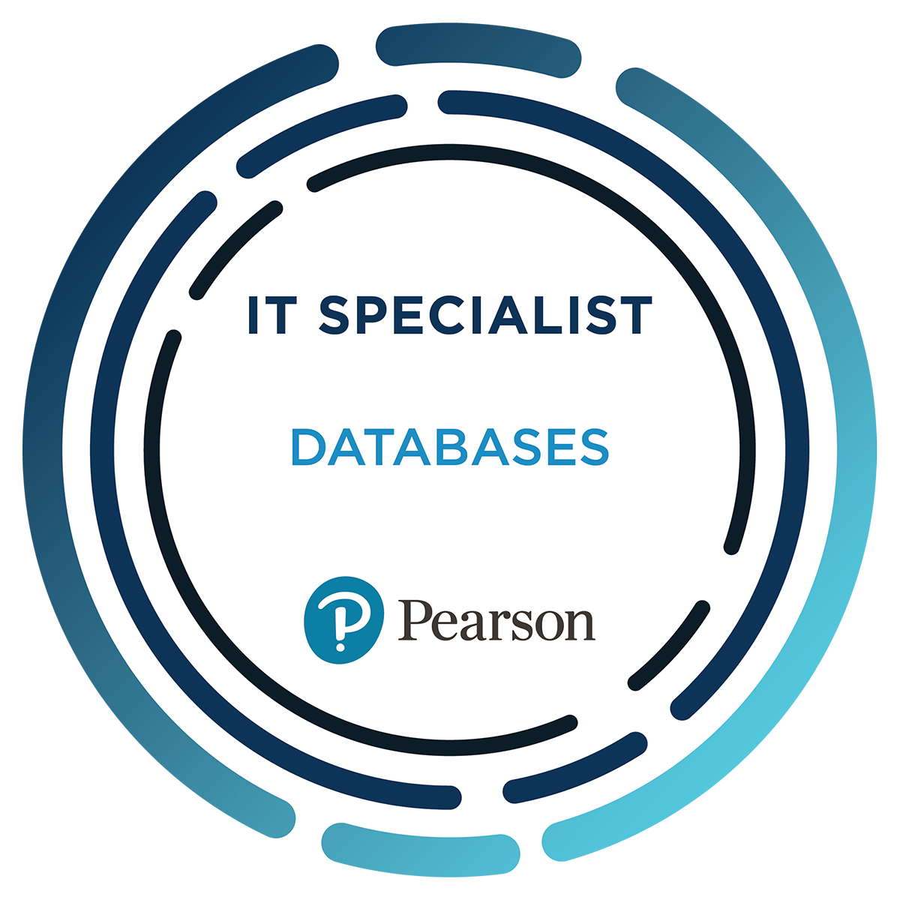
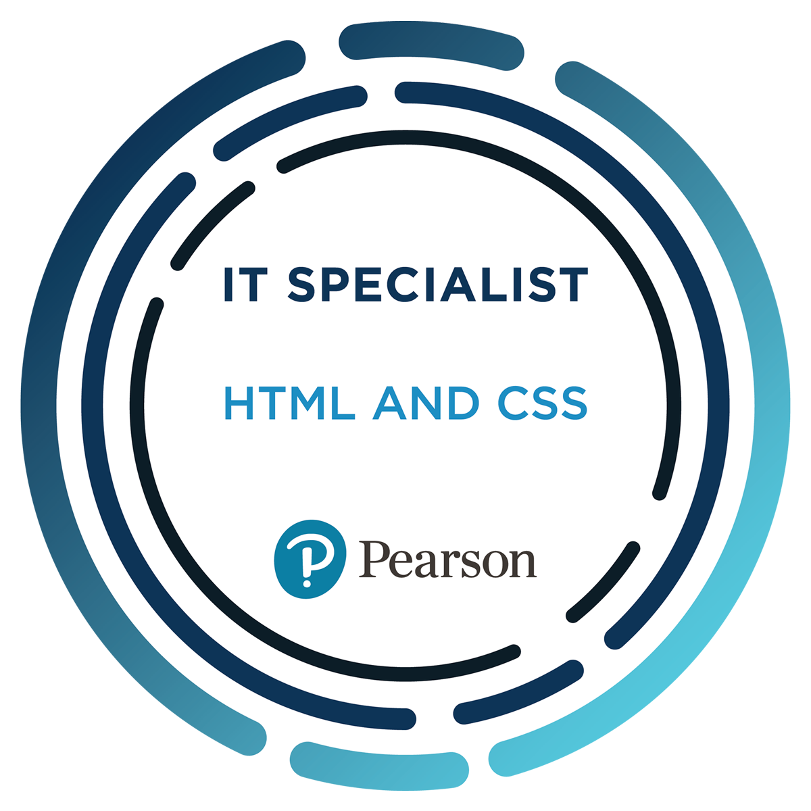

  

  <strong>Building systems that don't just work but work smart.</strong>

  I specialize in transforming complex challenges into efficient, scalable digital solutions. 
  From automated reporting tools to real-world operational systems, 
  I design technology that delivers clarity, performance, and impact.

  

---

<h2 align="center">🏅 Certifications & Professional Badges</h2>

  
  
  
  

---

<h2 align="center">🧠 Professional Focus</h2>

<table width="80%">
<tr>
<td align="center" width="50%">

### 🚀 Development
Full-Stack Application Architecture  
Laravel & Modern Web Systems  
Scalable Backend Design  

</td>
<td align="center" width="50%">

### ⚙️ Optimization
Workflow Automation  
System Performance Tuning  
Process Efficiency Engineering  

</td>
</tr>
<tr>
<td align="center">

### 🔐 Security
Information Assurance  
Network & System Protection  
Security Fundamentals  

</td>
<td align="center">

### 📊 Intelligence
Data-Driven Reporting  
Decision Support Systems  
Analytical Solutions  

</td>
</tr>
</table>

---

<h2 align="center">📌 Core Interests</h2>

<table width="80%">
<tr>
<td align="center" width="50%">

### 💻 Engineering
Software Architecture  
Application Development  
Complex Problem Solving  

</td>
<td align="center" width="50%">

### 📈 Analytics
Data Visualization  
Analytical Systems  
Insight Generation  

</td>
</tr>
<tr>
<td align="center">

### 🎨 Experience
UI/UX Design  
Human-Centered Interfaces  
Interaction Design  

</td>
<td align="center">

### 🌍 Impact
Purpose-Driven Systems  
Digital Transformation  
Real-World Solutions  

</td>
</tr>
</table>

---

<h2 align="center">📫 Professional Collaboration</h2>

I welcome opportunities to collaborate on impactful projects and innovative solutions. 
If my work aligns with your goals, feel free to connect — I am always open to meaningful professional discussions.

<strong>"Code with purpose. Build with impact."</strong>

---

<h2 align="center">🌐 Socials</h2>

  
  &nbsp;
  
  &nbsp;
  
  &nbsp;
  

---

## 💻 Tech Stack

<table>
<tr>
<td align="center" width="50%">

### 🖥️ Languages

</td>
<td align="center" width="50%">

### 🎨 Frontend

</td>
</tr>

<tr>
<td align="center">

### ⚙️ Backend & Frameworks

</td>
<td align="center">

### ☁️ Cloud & DevOps

</td>
</tr>

<tr>
<td align="center">

### 🗄️ Databases

</td>
<td align="center">

### 🛠️ Tools & Design

</td>
</tr>
</table>

